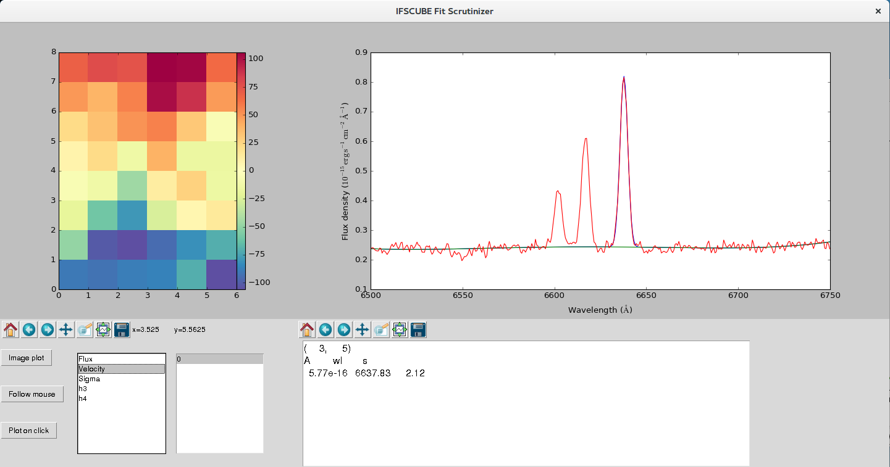
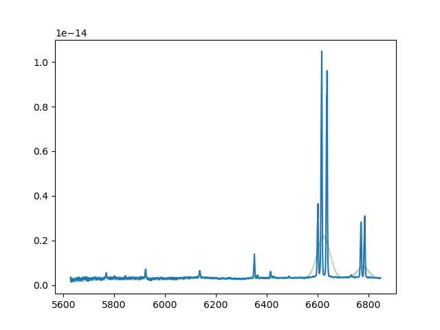
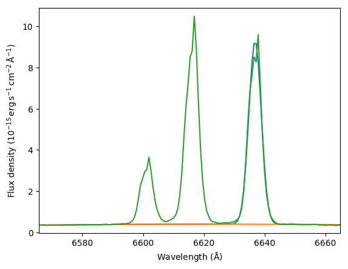

Introduction
============

What is IFSCube?
----------------

IFSCube is a python package designed to perform analysis tasks in data
cubes of integral field spectroscopy. It was originally designed to work
with the data from Gemini’s Multi-Object Spectrograph (GMOS), and as
such, many default parameters are set to work best with this kind of
data. Using it with data cubes from other instruments should be possible
by explicitly setting a few more parameters.

Keep in mind that this is not a closed software that will be called from
the command line and perform the tasks that you might want. Instead it
is intended to be used as part of your own scripts, hopefully making
them a lot more concise, and saving you a lot of time. At the same time,
since everything you can do in a python script can also be done using an
interactive interpreter such as ipython, you can also perform your
analysis on the fly.

For the specific task of fitting spectral features there is an
executable script that can be called from the command line, and
controlled via an ASCII configuration file. This is the recommended
method for line fitting, as many of the preparation steps can be easily
set up by the configuration parser.

Installation instructions
-------------------------

The preferred method for the installation of IFSCube is to use pip. Pip
can install directly from the git repository using the following
command:

::

    pip install git+https://danielrd6@bitbucket.org/danielrd6/ifscube.git

IFSCube uses third party programs that are not distributed with the
package, namely pPXF and Voronoi Binning, written by Michelle
Cappellari. If you wish to use IFSCube in conjunction with these
programs you will have to install them first, by downloading and
following the instructions at the following address:
http://www-astro.physics.ox.ac.uk/ mxc/software/ Upgrade

If you want to upgrade an existing installation of IFSCube use

::

    pip install --upgrade git+https://danielrd6@bitbucket.org/danielrd6/ifscube.git

If you are having trouble with the Fortran compiler you can force one
with pip’s install options, which are exemplified below.

To force a specific compiler:

::

    pip install git+https://danielrd6@bitbucket.org/danielrd6/ifscube.git
    --install-option=build --install-option='--fcompiler=gnu95'

IFSCube has been extensively tested with the astroconda [1]_
distribution, therefore it is highly recommended that you install it
within the astroconda’s Python 3 environment.

If you want to be able to change the package to suit your needs, or
contribute with your own code to the project, it is recommended to clone
the git repository and install the package as an editable package.

::

    git clone https://danielrd6@bitbucket.org/danielrd6/ifscube.git
    cd ifscube
    pip install -e .

Single spectrum fitting
=======================

One of the functions available for IFSCube allows for the fitting of a
single 1D spectrum. This is very useful when experimenting parameters
for the fits using a combined, higher signal-to-noise, spectrum from the
data cube. There is even a executable script to perform the fits using
parameters given in a configuration file.

specfit usage
-------------

After the installation of IFSCube the executable specfit should be
available in your path. If not, the script is located in the bin
directory of the IFSCube installation directory.

The simplest way to use the program is to just invoke it as

::

    specfit -c halpha.cfg manga_onedspec.fits

Here, and in all subsequent examples, we will use the data available in
the ifscube/examples directory. The above command specifies the
configuration file with the **-c** option. If you want to know more
about the command line options of linefit just execute it with the
**-h** option, and a help page will be printed.

The configuration file halpha.cfg, present in the examples directory,
showcases the syntax and some of the possibilities of specfit. The
reader is strongly encouraged to start with that file and modify it for
her/his fits.

Configuration file
------------------

The configuration file for specfit follows the formalism of typical
*.ini* files, with sections defined by strings within brackets and
parameter as strings followed by **:** or **=** and the corresponding
value. Comments are possible, and are declared by either a **#** or a
**;**. In the following subsections each section of the configuration
file will be discussed in more detail. Boolean options, such as
fit\_continuum and overwrite take ’yes’ or ’no’ as values.

fit
~~~

This part of the configuration file sets the main options of the fitting
process.

-  | **fit\_continuum**: ’yes’, ’no’
   | Fits a polynomial pseudo continuum before fitting the spectral
     features.

-  | **function**: ’gaussian’, ’gausshermite’
   | Sets the function to be used as the spectral feature profile. It
     can be either ’gaussian’ or ’gausshermite’.

-  | **fitting\_window**: lambda\_0:lambda\_1
   | Spectral window in which to perform the fit.

-  | **outimage**: string
   | Name of the output FITS file.

-  | **overwrite**: ’yes’, ’no’
   | Overwrites the output file if it already exists.

-  | **optimize\_fit**: ’yes’, ’no’
   | Only fits pixels that are close to the spectral features set in the
     configuration file. For instance, if you want to fit a spectrum
     that goes from 4800Åto 7000Å, but is only interested in the [O III]
     5007 and [N II] 6583 lines, you can set this option to ’yes’, and
     save the computing time required for all the zeros in between.

-  | **optimization\_window**: number
   | Size of the optimized fitting window in units of the sigma given as
     initial guess. If optimize\_fit is set to yes (see above) Only
     pixels with wavelength between (wavelength - optimization\_window
     \* sigma) and (wavelength + optimization\_window \* sigma) will be
     evaluated by the fitting algorithm.

-  | **suffix**: string
   | Suffix to attach to the name of the input file. The resulting
     concatenation will be the output file’s name.

-  | **verbose**: ’yes’, ’no’
   | Shows a nice progress bar.

-  | **writefits**: ’yes’, ’no’
   | Writes the output of the fit to a file.

-  | **guess\_parameters**: ’yes’, ’no’
   | Makes an initial guess for the amplitude, centroid and sigma of
     each spectral feature based on the spectrum. Setting this option to
     yes **does not** mean that you can leave the line definition
     sections empty. A lot of other routines within the algorithm are
     based on the initial parameters you give for each spectral feature.

-  | **test\_jacobian**: ’yes’, ’no’
   | Checks if there are null values in the jacobian matrix of the fit.
     If there are, it usually means that the spectral feature is in a
     flagged section of the spectrum, or that the best fit is a line
     with zero amplitude.

loading
~~~~~~~

The **loading** section is dedicated to parameter that tell specfit how
to load your spectrum from the FITS file. Each parameter listed below
takes as input value a string that should match the name of the FITS
extension in the input MEF file containing the appropriate data. It is
important to point out that all the extensions must match the dimensions
of the observed spectrum, except for the primary, which should only
contain a header.

-  **scidata**: Scientific data, or the actual observed spectrum.

-  **primary**: Primary extension, with the main header.

-  **variance**: Pixel by pixel variance.

-  **stellar**: Stellar spectrum to be subtracted from the observed
   spectrum before the fit.

-  **flags**: Flag spectrum, with zeros setting value that should not be
   used.

-  **redshift**: This is the only parameter that is not supposed to be a
   FITS extension. specfit is designed to read a redshift from the
   primary extension header. If a ’redshift’ keyword is not found, it
   tries to read the redshift given in the configuration file. If none
   is given in either way, the spectrum is assumed be to already in the
   rest frame.

minimization
~~~~~~~~~~~~

This section controls the minimization algorithm, and its parameters are
directly passed on to the *scipy.optimize.minimize* function. A number
of different solvers are accessible via the *minimize* function, but
currently specfit only The reader is encouraged to read the
documentation for the scipy function in order to gain a deeper
understanding of the fitting process. In the parameter list below a few
example values are offered as a suggestion.

-  | **eps**: (1e-2) number
   | Step size used for numerical approximation of the jacobian.

-  | **ftol**: (1e-5) number
   | Precision goal for the value of f in the stopping criterion.

-  | **disp**: ’yes’, ’no’
   | Displays detailed information of the fit.

-  | **maxiter**: 100 number
   | Maximum number of minimization iterations.

continuum
~~~~~~~~~

This part of the configuration file sets the parameters for the fitting
of the pseudo continuum. The continuum is defined as a polynomial of
arbitrary degree, which is fit to the spectrum after the subtraction of
the stellar component, if there is one.

Emission lines and other data points that should not be considered in
the continuum fit are eliminated via an iterative rejection algorithm.
For this reason, the fitting\_window set in the *fit* section should
provide enough room for an adequate sampling of valid continuum points.

-  | **degr**: integer number
   | Degree of the polynomial.

-  | **niterate**: integer number
   | Number of rejection iterations.

-  | **lower / upper\_threshold**: number
   | The rejection threshold in units of standard deviation.

Feature definition
------------------

Features to be fitted are defined as sections with arbitrary names, with
the exception of fit, minimization and continuum, which are reserved.
The basic syntax for a feature, or spectral line, definition is as
follows:

::

    [feature_name]
    <paremeter0>: <value>, <bounds>, <constraints>
    <paremeter1>: <value>, <bounds>, <constraints>
    ...

Parameters
~~~~~~~~~~

The valid parameters are for each feature are: wavelength, sigma, flux,
k\_group and continuum\_windows. Wavelength, sigma and flux are
mandatory for every spectral feature, and are pretty much self
explanatory. Note that here **sigma is given in units of wavelength**.
The last two parameters are optional, and deserve some explanation.

The parameter **k\_group** stands for kinematic grouping, and it
basically is an automated way to specify that the Doppler shift and
sigma of all features sharing the same **k\_group** should be equal. To
set it, one only needs to specify an arbitrary integer number as the
value for a given feature, and repeat that same number for all other
features sharing the same kinematics.

Lastly, **continuum\_windows** specifies the windows for the pseudo
continuum fitting used in the equivalent width evaluation, and are not
used anywhere else. It should be given as four wavelength values
separated by commas.

Bounds
~~~~~~

Bounds for each parameter are given in one of two ways: i) two values
separated by a **:**, or ii) a single value preceded by **+-**. For
instance, if you want to set the wavelength for a given feature

::

    wavelength: 6562.8, 6552.8:6572.8

or

::

    wavelength: 6562.8, +-10 

Bounds can also be one-sided, as in

::

    flux: 1e-15, 1e-19:

which will be interpreted as having only the lower limit of 1e-19 and no
upper limit.

Constraints
~~~~~~~~~~~

Constraints are perhaps the most valuable tool for any spectral feature
fitting. We already discussed the automated constraints that keep the
same kinematical parameters for different spectral features using the
**k\_group** parameter, but specfit also accepts arbitrary relations
between the same parameter of different features. For instance, suppose
you want fix the flux relation between two lines you know to be
physically connected, such as the [N ii] lines at 6548Åand 6583Å.

::

    [n2_a]
    wavelength: 6548
    sigma: 2
    flux: 1e-15,, n2_b / 3
    k_group: 0

    [n2_b]
    wavelength: 6583
    sigma: 2
    flux: 1e-15
    k_group: 0

The double comma before the constraint is there because value, bounds
and constraints are separated by commas, and even if you do not want to
set any bounds, an extra comma is necessary for the parser to correctly
identify the constraint.

Now let us discuss the syntax of the constraint, which is the expression
**n2\_b / 3**. The parser accepts simple arithmetic operations (\*, /,
+, -), inequality relations (:math:`<`, :math:`>`), numbers and feature
names. The feature name is the name given to the section containing the
spectral feature parameters, and the parameters constrained are always
the same parameters in different features. Currently the parser does not
support relating the sigma of some line to the flux of some other line.

Datacube fitting
================

Using IFSCUBE to fit emission lines in data cubes is very similar to
fitting a single spectrum, which is described in section
[sec:singlespecfit]. To start the fitting process you must call the
cubefit executable script from the command line.

::

    cubefit -c halpha_cube.cfg ngc3081_cube.fits

Here we are using the provided example files distributed with ifscube.

For more information on the available command line options of cubefit,
please read the help page printed by

::

    cubefit -h

Configuration file
------------------

There are only minor differences between the configuration files of
specfit and cubefit, which will be covered in the following subsections,
each relating to a particular section of the configuration file. Please
refer to section [sec:singlespecfit] for parameters and options that
also apply to single spectrum fitting.

fit
~~~

-  | **individual\_spec**: ’no’, ’x, y’, ’peak’ or ’cofm’
   | If set to ’no’ fits all the spectra in the datacube, else fits only
     one spectrum. If set to ’x, y’ fits the spectrum in the spaxel with
     horizontal coordinate ’x’ and vertical coordinate ’y’. ’peak’ will
     fit only the spaxel with the highest value in an image resulting
     from the sum of all the pixels along the dispersion direction.
     ’cofm’ is similar to ’peak’, but uses the center of mass instead.

-  | **refit**: ’yes’, ’no’
   | Uses parameters from previous successful fits as the initial guess
     for subsequent fits. The parameters are the average of the results
     for fits returning a fit\_status of 0 within a given refit\_radius.

-  | **refit\_radius**: number
   | Radius in pixels to use when averaging parameters for the updated
     initial guess.

-  | **spiral\_loop**: ’yes’, ’no’
   | Fits the spaxels following a spiral pattern from the specified
     spiral\_center outwards. This is particularly useful when refit is
     set to ’yes’, since the algorithm will start from the highest
     signal to noise ratio spectra.

-  | **spiral\_center**: ’x, y’, ’peak’ or ’cofm’
   | Chooses where the spiral pattern will start. See *individual\_spec*
     above for a description of the meaning of ’x, y’, ’peak’ and
     ’cofm’.

Checking fit results
--------------------

[t].5

Frank Zappa

The fastest way to check the results of your fit is to use the
fit\_scrutinizer program. This program has graphical user interface
(GUI) that lets you select each parameter of each component, and see the
image of that parameter at the same time showing the spectrum of a
particular spaxel. After installation of IFSCube by the pip installer,
fit\_scrutinizer will be appended to your path, making it accessible
from any directory directly from the command line.

For instance, let us take a look at that first attempt at a data cube
fit, saved as myfit.fits. The data cube that originated it is the
ngc3081\_cube.fits, therefore the calling sequence to fit\_scrutinizer
should read

::

    fit_scrutinizer ngc3081_cube.fits myfit.fits

This will star a GUI similar to the one in the figure below, but
without any of the plots yet. To start plotting your results you have to
select a parameter from the list at the lower left corner, and a
component from the list right next to it. In this example we selected
the velocity for the only component available, component “0”. Next we
click “Image plot” to generate the image of the velocity for the first
component in the upper left.

    Example of the interface of the fit_scrutinizer program, showing the
    velocity image, and the spectrum in the spaxel (3, 5).

At this point only the image is visible, but no spectral plot will be
produced until you click on either “Follow mouse” or “Plot on click”.
The former will cause a new spectral plot to be generated every time the
mouse enters a new spaxel on the image at the upper left, while the
latter will only plot the spectrum when you click on a spaxel.

The output file
---------------

The output file generated by cubefit is a Multi-Extension FITS file
(MEF), consisting of images and tables that store the results of the
fitting process. This file can be accessed by any program capable of
dealing with the FITS format.

Let us start by taking a look at the extensions that are present in the
output file of the example fit for ’ngc3081\_cube.fits’. If you have not
changed the example configuration file, the output file should be named
’ngc3081\_cube\_linefit.fits’. I recommend opening a interactive python
interpreter, such as ipython, and entering the following commands:

::

    from astropy.io import fits

    cube = fits.open('ngc3081_cube_linefit.fits')

    cube.info()

The output should read:

::

    Filename: ngc3081_cube_linefit.fits
    No.    Name      Ver    Type      Cards   Dimensions   Format
      0  PRIMARY       1 PrimaryHDU      70   ()
      1  FITSPEC       1 ImageHDU        13   (6, 8, 1660)   float64
      2  FITCONT       1 ImageHDU        13   (6, 8, 1660)   float64
      3  STELLAR       1 ImageHDU        13   (6, 8, 1660)   float64
      4  MODEL         1 ImageHDU        13   (6, 8, 1660)   float64
      5  SOLUTION      1 ImageHDU        17   (6, 8, 10)   float64
      6  EQW_M         1 ImageHDU        17   (6, 8, 3)   float64
      7  EQW_D         1 ImageHDU        17   (6, 8, 3)   float64
      8  STATUS        1 ImageHDU        16   (6, 8)   int64
      9  MASK2D        1 ImageHDU        16   (6, 8)   int64
      10  SPECIDX       1 BinTableHDU     13   48R x 2C   ['K', 'K']
      11  PARNAMES      1 BinTableHDU     13   9R x 2C   [7A, 2A]
      12  FITCONFIG     1 BinTableHDU     13   39R x 2C [64A, 64A])

There are 13 extensions within the output file, and I will now explain
briefly what each of them contains.

-  PRIMARY: This is just a copy of the original header extension of the
   input file. Ideally this should have a good description of what the
   science data is.

-  FITSPEC: A copy of the input science data, without any changes other
   than a trimming to the given fitting window. It has dimensions of
   (columns, rows, wavelength).

-  FITCONT: If a continuum was fit to the data, this extension will
   contain the values of that pseudo-continuum at each wavelength
   coordinate.

-  STELLAR: The stellar continuum, or stellar population spectra, if it
   was supplied to cubefit.

-  MODEL: This extension contains the modeled spectrum, which is the sum
   of all the spectral features that were fit to the data.

-  SOLUTION: The resulting parameters of the fit, plus the reduced
   :math:`\chi^2` of the fit. In this case there were 3 spectral
   features fit with 3 parameters each, plus the :math:`\chi^2` plane,
   resulting in a depth of 10. The exact nature of each plane is given
   in the PARNAMES extension.

-  EQW\_M: The equivalent width of the modelled spectral feature.

-  EQW\_D: The equivalent width measured directly on the spectrum, but
   with all the other spectral features subtracted.

-  STATUS: An integer that specifies the exit status of the fit. A value
   of 0 signifies a successful fit.

-  MASK2D: An image mask, applied to the datacube, specifying which
   spaxels were not included in the fit.

-  SPECIDX: A table containing the spaxel coordinates of all the spaxels
   included in the fit.

-  PARNAMES: A table in which the first column specifies the name of the
   spectral feature, and the second specifies the parameter for that
   spectral feature. In a gaussian fit the parameters are A, wl and s,
   representing the amplitude, central wavelength and sigma of the
   gaussian in wavelength units. For a Gauss Hermite fit the A parameter
   represents the integrated flux, and there is the addition of the
   parameters h3 and h4, which stand for the third and fourth order
   coefficients of the Gauss Hermite polynomial.

-  FITCONFIG: This is a copy of the input configuration file, with the
   first column storing the parameter name in section.parameter
   notation, and the second column storing the value of that parameter.

The IFSCube package
===================

Basic Functions
---------------

The *datacube* module contains the base class *Cube*, which includes all
the major methods for dealing with integral field spectroscopy data
cubes, as well as some basic functions that allow a quick inspection of
the data cube. Different data cubes have different ways of organizing
the data, and they best way to deal with them in a progammatic manner is
to write a subclass of *Cube*. The recommended usage, for a generic data
cube, is always to first load your data as a *Cube* object. Modules for
reading cubes processed by gireds [2]_ and pycasso2 [3]_.

The examples in this section will use the ngc3081\_cube.fits file,
present in the examples directory.

::

    from ifscube import cubetools as ct

    mycube = ct.gmosdc('ngc3081_cube.fits')

The initialization method for *Cube* sets up a few basic variables that
will be used in the analyses tasks, such as the wavelength, rest
wavelength, science data, noise cube, etc. The rest wavelength
specifically, is only properly set if you enter the redshift when
initializing the object, such as in

::

    mycube = ct.gmosdc('ngc3081_cube.fits', redshift=0.042)

If no redshift is given then the rest wavelength will be just a copy of
the observed wavelength. In either case, all the methods within the
*Cube* class will always interpret wavelengths as referring to the rest
frame wavelength.

Image from wavelength cut
~~~~~~~~~~~~~~~~~~~~~~~~~

Data cubes have three dimensions, i.e. two spatial and one spectral. In
order to have an image of the data cube one has to select a wavelength
range, or collapse the entire cube along the spectral dimension. Often
it is useful to have an image at a specific wavelength, and for that
there is the *wlprojection* function. The latter takes the data cube,
multiplies it by a filtering function and returns the resulting array.
Two arguments are required by *wlprojection*, namely the central
wavelength and the FWHM of the filtering function. Additionally, there
is the optional *filtertype* argument, which selects the type of
filtering used to produce the image. Currently you can choose between a
box function and a gaussian.

For instance, if you want to have an image of the data cube centered on
6000 Åwith a FWHM of 100 Å

::

    im = a.wlprojection(6000, 100)

Fitting emission lines
----------------------

One of the main purposes and motivations behind the development of
IFSCube is the fitting of emission lines in the spectra of galaxies.
This is a common task for 1D spectra, and therefore there is a plethora
of software than can achieve it fairly well, from IRAF’s splot onward.
However, fitting data cubes requires a code that can run with little to
no interaction from the user, since the modeling process is expected to
run on several hundred spectra.

The *linefit* function of the *Cube* class was designed specifically for
the fitting of emission or absorption lines spectroscopic data cubes. It
is basically a wrapper for the *scipy.optimize.minimize* function, with
the addition of many tools for doing the minimization recursively over
the entire cube. The reader that wants to gain a deeper understanding of
the fitting process inside *linefit* is strongly advised to read the
documentation for *minimize*.

The IFSCube distribution includes a heavily spatially under sampled data
cube for the NGC 3081 galaxy, which will be used in the examples below.
You can find it within the *examples* directory, under the path of your
installation of IFSCube.

Line fitting, a basic example.
~~~~~~~~~~~~~~~~~~~~~~~~~~~~~~

The first thing you will need to do to start using the functions
contained in IFSCube is to load your data cube as a gmosdc object. This
will start the basic variables that will be used by analysis functions.
IFSCube was designed to work with Multi Extension FITs files, and relies
on the astropy.io.fits package to read them.

In a python shell, or in your script, you should start by importing the
module and initializing the *gmosdc* object.

::

    from ifscube import cubetools as ct

    mycube = ct.gmosdc('mycube.fits')

In case you have a noise estimate in the form of a cube of
:math:`\sigma`, you can load it automatically by giving the extension
number as a parameter to gmosdc. If available, this noise information
will be used for plotting your spectra and for evaluating the reduced
:math:`\chi^2` of the line fitting.

::

    mycube = ct.gmosdc('ngc3081_cube.fits', var_ext=2)

Now let us take a look at a particular spectrum of the data cube, using
the *plotspec* method. This method takes two mandatory arguments, which
are the horizontal and vertical spaxel coordinates. The following
example will cause a plot of the spectrum at spaxel (3, 3) to appear.

::

    mycube.plotspec(3, 3)

If all went well, you should see the plot in figure [fig:plotspec]. The
shaded smoothed region is the noise estimate from extension 2. If you do
not have the noise extension this shaded region will simply not be
plotted, but otherwise everything should work equally well.

   Example of the plotspec method.

If we zoom in around the H\ :math:`\alpha` region you will get a clearer
picture of the emission lines, which will be instrumental in defining
the initial guess for the line fitting process. Suppose now that we are
only interested in fitting the [N ii] line, ignoring the neighboring [N
ii] and H\ :math:`\alpha` lines. We should start by defining a list of
initial parameters which we will call *p0*. This list has to be in the
order of amplitude, central wavelength and sigma for a Gaussian profile
fit.

::

    p0 = [
        1e-14,  # The flux at the center of the line.
        6635.0,  # The central wavelength.
        3.0,  # The sigma in wavelength units.
        ]

Also, although not mandatory, it is always good to define a fitting
window. This will help the code find a suitable continuum level and save
time by not fitting a lot of zeros far away from the line of interest.
By default, the continuum will be inferred from a polynomial fit to the
spectrum with an aggressive sigma clipping. Most of the time this leads
to good results, but you can change the parameters for the continuum
fitting or provide a continuum entirely defined by you using the
argument *copts* or setting the *mycube.cont* property. Both of these
options will be discussed in more detail later. For this example we are
fitting within 6500 and 6750 Å.

We should also choose a profile function for the emission line.
Currently only Gaussian and Gauss-Hermite profiles are supported. We
tell linefit which one to use by setting the argument
*function=’gaussian’*. For a Gauss-Hermite profile use ’gauss-hermite’.

Finally, since we are not trying to fit the whole data cube in our first
run, we should set the *individual\_spec* argument to some tuple
defining the coordinate of the desired spaxel, just like in the
*plotspec* function discussed above.

The complete call to the linefit function should look like the
following.

::

    mycube.linefit(p0, function='gaussian', fitting_window=(6500, 6750),
                   individual_spec=(3, 3))

When fitting a single spaxel, this function returns a lot of information
that will only be stored in the gmosdc object during data cube runs.
This behavior is particularly useful for interactive runs, as it gives
immediate access to the main fit products, thus facilitating the user’s
evaluation of the fitting procedure.

In order to see the result of this fit, you can use the plotfit method,
which again takes the spaxel coordinates as arguments. This method will
plot every component of the fit (in this case it will be only the
Gaussian profile and the continuum), the observed spectrum and the
modeled spectrum.

::

    mycube.plotfit(3, 3)

Figure [fig:plotfit] shows a zoomed in view of plotfit’s result. In this
example the green line represents the observed spectrum, the blue line
is the modeled line profile added to the continuum, and the orange line
is the continuum. Plotfit also prints the fit parameters in the
terminal, as in the example below.

::

    A         wl        s         
      8.89e-15   6636.85     -2.05

Notice how the :math:`\sigma` value turned out negative. Since only
:math:`\sigma^2` is used in the Gaussian profile, the minimization
algorithm can make no distinction between positive and negative values.
This can be prevented by setting bounds to each parameter, which will be
discussed in further detail in another section.

   Example of the plotfit function.

If all went well and we are satisfied with our fitting, we can go ahead
and remove the *individual\_spec* argument, and let linefit run over the
entire data cube. Removing this argument will cause linefit to return
the fit parameters in a data cube of spatial dimensions equal to the
original data, and depth equal to the number of parameters plus one. The
last plane of this solution cube is the reduce :math:`\chi^2` of the
fit.

::

    mycube.linefit(p0, function='gaussian', fitting_window=(6500, 6750))

Even if you do not choose to store the output in a variable, it will be
stored in the mycube.em\_model property. It is also advisable to save
the results of the fit in a FITS file, by setting the arguments
*writefits=True* and *outimage=’myfit.fits’*. This will allow you to use
the *fit\_scrutinizer* utility to check the results of your fits (see
section [sec:scrutinizer].

Setting bounds
~~~~~~~~~~~~~~

If perchance you went ahead and tried to fit the entire data cube with
the parameters of the last section you mostly likely got disappointed
with the results. Alas, life is not that simple, neither is
minimization. A good fit, other than having a good initial guess, should
have bounds. They prevent the minimization algorithm from wandering too
far away from the physically sound parameters.

Bounds for linefit are a list of pairs, with each pair representing the
minimum and maximum values of the parameters, respecting the same order
of the initial guess. For instance, let us say that the amplitude should
not be negative, neither should it be greater than 1e-13. Our initial
guess for the central wavelength should be within 5 Å of the correct
answer and the sigma should be above 1 Å and below 6 Å. Therefore

::

    b = [
            [0, 1e-13],
            [6630, 6640],
            [1, 6],
    ]

We now pass this list as an argument to linefit and see how that turns
out.

::

    mycube.linefit(p0, function='gaussian', fitting_window=(6500, 6750), bounds=b)

Multiple lines
~~~~~~~~~~~~~~

Following the basic example of a single line fit, we will now discuss
how to fit multiple lines simultaneously. The basic process remains the
same, the only thing that will change is the number of parameters in the
initial guess and the number of bounds. The *linefit* function is
prepared to work with an arbitrarily large number of components, as long
as they have the same profile function, i.e. Gaussian or Gauss-Hermite.
[4]_

In the next example we will fit both [N II] and the H\ :math:`\alpha`
line. Our initial guess :math:`p0` will be

::

    p0 = [
        1e-14,  # The flux at the center of the line.
        6601.0,  # The central wavelength.
        3.0,  # The sigma in wavelength units.

        1e-14,  # The flux at the center of the line.
        6617.0,  # The central wavelength.
        3.0,  # The sigma in wavelength units.

        1e-14,  # The flux at the center of the line.
        6635.0,  # The central wavelength.
        3.0,  # The sigma in wavelength units.
        ]

Of course this is a little tedious to write explicitly, and we can try
to do it programmatically, like

::

    lambda_0 = [6601, 6617, 6635]
    p0 = []
    for i in range(3):
        p0 += [1e-14, lambda_0[i], 3]

Or even, if you would like to have a piece of code with all the
components clearly distinguished you could define three lists, one for
each of the components, and later state that :math:`p0` is the sum of
all three.

::

    n2a = [1e-14, 6601, 3]
    ha = [1e-14, 6617, 3]
    n2b = [1e-14, 6635, 3]
    p0 = n2a + ha + n2b

The bounds can also be set programmatically based on our initial guess.
For instance, if you want to keep loose bounds for the amplitude and the
sigma, but want to be stringent on the central wavelength you could
write

::

    b = []
    for i in range(0, len(p0), 3):
        b += [[0, 1e-13]]  # Amplitude positive and below 1e-12
        b += [[p0[i + 1] - 5, p0[i + 1] + 5]]  # Central wavelength within 5 A
        b += [[1, 6]]  # Sigma between 1A and 6A

The call to linefit is exactly the same as before, the only difference
lies in the definition of :math:`p0` and :math:`b`. Figure
[fig:multiple] shows the result of this fit for the spectrum in the
spaxel (3, 3).

.. figure:: figs/multiple_components.pdf
   :alt: Example of a multiple component fit for the same spaxel (3, 3).

   Example of a multiple component fit for the same spaxel (3, 3).

Error descriptions
------------------

For each spectrum that is fitted a fit status number is returned. If the
number is 0 it means that the fit was successful, otherwise something
went wrong.

.. [2]
   gireds is a pipeline for reducing GMOS data.

.. [3]
   pycasso2 is a package for processing data cubes, with a special focus
   on providing a direct way to run starlight (Cid Fernandes et al.
   2001)

.. [4]
   A complementary version of *linefit* that accepts
   astropy.models.FittableModel instances instead of the internally
   defined functions is currently under development.
