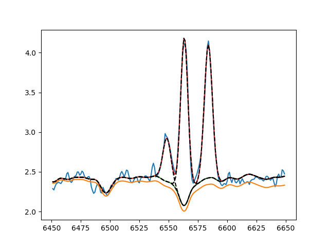

Quick start
===========

This tutorial will show you how to make a quick fit using :mod:`ifscube`, both
for one dimensional spectra and for data cubes.

1D Spectra
----------

We start by running the fit with one of the configuration files provided
in the examples directory. Navigate to the examples directory within the
:mod:ifscube installation directory and execute the following command.

::

    specfit -opc halpha_gauss.cfg manga_onedspec.fits

If everything was correctly installed, this command should produce a plot
of the [N II] and H_alpha lines, and print some fit information on the
terminal. The options used here are **-o** for overwriting a previously
created output file, **-p** for plotting the result after the fit and **-c**
for specifying the configuration file.

The output plot should look very similar to the one in the figure below

    Example output of specfit.

The quickest way to start fitting your own spectra is to modify the *halpha_gauss.cfg*
file to suit your needs, and apply that to your data.

Data cubes
----------

As with the one dimensional case, we recommend starting by running the example.
Navigate to the examples directory within the
:mod:ifscube installation directory and execute the following command.

::

    cubefit -opc halpha_cube.cfg ngc3081_cube.fits

A plot will appear showing the results of the fit for one spaxel. If you want to
see the results for the whole data cube check out the section :ref:`check_fit`.
